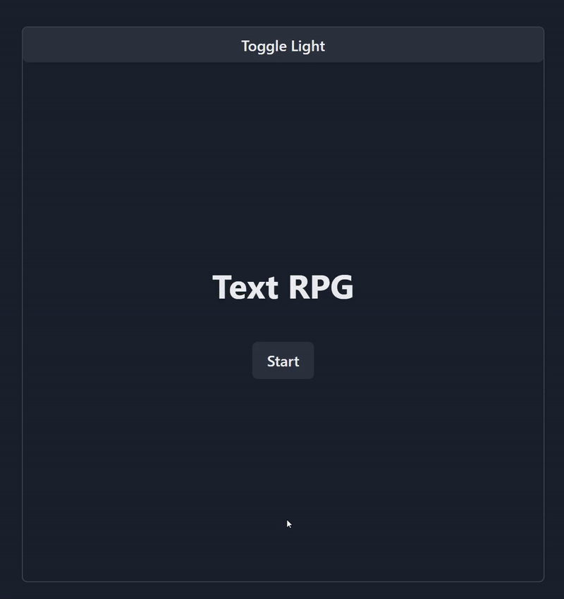

<!--
README Template: https://github.com/alecortega/portfolio-template/
-->

# Text RPG

A text RPG where you are a robber trying to rob a bank. Explore all the possible options and endings.

Every choice you make will change your life.

## Running the App

1. Open the folder in a terminal
2. Run `npm install` to install npm packages
3. Run `npm start` to start the app
4. Play the game!

## How It's Made

The application is built using JavaScript (TypeScript) and React.

The UI component library of choice is Chakra UI. I chose this because my requirements are simple and I do not require complicated styling.

## Lessons Learned

In the beginning, I wrote the app in plain JavaScript and then converting to TypeScript. It took more time than I expected because I kept missing props. In the future, I would start a project in TypeScript (or other JavaScript flavors) right off the bat.

This app was completed within my targeted timeframe of six months because I was cutting down on the MVP. While I had a lot more functions that I wished to implement into the app, I know I would have gotten unmotivated and overwhelmed. I believe I made the right choice to omit requirements.

## Future Possibilities

As mentioned earlier, I have a lot more functions that I had cut from the MVP, but below are some features that could possibly be added.

- Create an editor UI, where users can upload or write a custom story
  - Create a database to store custom stories
- Create a database to store user saves/progress
- Incorporte audio into the story, like sound effects or using text to speech to read out dialogue
- Mobile friendly UI
